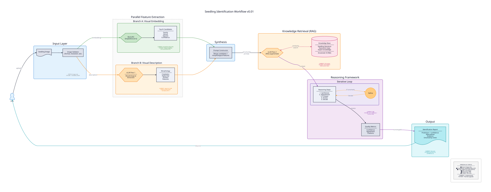

# SeedLearn

SeedLearn develops AI-assisted tools for identifying tropical tree seedlings from field-collected image sets. It combines BioCLIP 2 visual embeddings, vision-LLM morphological extraction, and literature RAG to evaluate family-, genus-, species-, and trait-level signals for tropical forest research.

## Architecture



See [Pipeline Reference](docs/pipeline.md) for the full 5-stage architecture, per-stage details, and design rationale.

## Quick Install

```bash
git clone git@github.com:nohemihuanca/seedlearn-nhn.git
cd seedlearn-nhn
module load uv && uv venv -p 3.13 && source .venv/bin/activate
uv pip install torch torchvision --index-url https://download.pytorch.org/whl/cu129
uv pip install -e ".[clip,pipeline,dev]"

# pybioclip + vLLM — custom wheels for RHEL 8 (shared NFS)
uv pip install /nfs/roberts/project/pi_lsc4/shared/seedlearn/software/py_wheels/pybioclip-*.whl
uv pip install /nfs/roberts/project/pi_lsc4/shared/seedlearn/software/py_wheels/vllm-*.whl
```

> **pybioclip** is a [fork](https://github.com/mitchellxh/pybioclip) of [Imageomics/pybioclip](https://github.com/Imageomics/pybioclip) (v2.1.1, commit `ddeb58f`) with GPU-accelerated taxonomy aggregation. Distributed as a pre-built wheel on shared NFS.

> **vLLM** requires a custom-built wheel on Bouchet because RHEL 8's glibc (2.28) is too old for pre-built PyPI wheels. See [vLLM Installation](docs/vllm-install.md) for details and rebuild instructions.

## Quick Start

Pre-computed embeddings, splits, and RAG index are available on shared NFS via the `data/` symlink. The pipeline requires a GPU node running a vLLM server — both the server and client must be on the **same host** so `localhost` resolves correctly.

### 1. Request an Interactive Desktop

Go to [OOD Bouchet](https://ood-bouchet.ycrc.yale.edu) → Interactive Apps → **Desktop**.

| Setting | Value |
|---------|-------|
| Partition | `gpu_devel` |
| Hours | 6 |
| CPU cores | 12 |
| Memory per CPU (GB) | 10 |
| Number of GPUs per node | 1 |

Check **"I would like to specify additional job options"** and add:

```
--gres=gpu:h200:1
```

Launch the session and open two terminals (Applications → System Tools → MATE Terminal).

### 2. Start the vLLM server (Terminal 1)

```bash
cd /path/to/seedlearn-dev
source .venv/bin/activate
bash scripts/start_vllm.sh
```

Wait for the `Uvicorn running on http://0.0.0.0:8000` confirmation before proceeding.

### 3. Run the pipeline (Terminal 2)

```bash
cd /path/to/seedlearn-dev
source .venv/bin/activate
python scripts/run_pipeline.py --specimen SRAPHEDE2 \
    --catalog data/raw/2026-01-29/sorted_12K/metadata/species_catalog_*.csv \
    --cache-dir data/embeddings/2026-01-29_v2026-01-29_12K \
    --split-path data/splits/2026-01-29_v2026-01-29_12K/family/split_seed42 \
    --rag-index data/traits/latest/rag_index/ \
    --report
```

See [CLI Reference](docs/scripts.md) for full argument documentation, few-shot evaluation workflows, and how to regenerate embeddings and splits.

For the current handoff/consolidation state, see [SeedLearn Project State, August 2026](docs/status/2026-08-project-state.md).

## Dataset Splits

Pre-computed individual-level splits (5 seeds, 70/15/15) are available on shared NFS. All images of the same plant stay in the same partition — no data leakage across train/val/test boundaries.

| Rank | Classes | Individuals | Images | Train | Val | Test | Max k-shot |
|------|---------|-------------|--------|-------|-----|------|------------|
| Family | 52 | 2,112 | 10,407 | 1,478 (7,270) | 317 (1,560) | 317 (1,577) | 10 |
| Genus | 114 | 2,112 | 10,407 | 1,478 (7,270) | 317 (1,560) | 317 (1,577) | 3 |
| Species | 164 | 2,112 | 10,407 | 1,478 (7,270) | 317 (1,560) | 317 (1,577) | 3 |

Format: `individuals (images)` per partition. Seeds 42-46. See [Data Reference](docs/data.md#splits--data-partitions) for per-class breakdowns.

To run the pipeline on a random test individual:

````bash
python scripts/run_pipeline.py --random test \
    --catalog data/raw/2026-01-29/sorted_12K/metadata/species_catalog_*.csv \
    --cache-dir data/embeddings/2026-01-29_v2026-01-29_12K \
    --split-path data/splits/2026-01-29_v2026-01-29_12K/family/split_seed42 \
    --rag-index data/traits/latest/rag_index/ \
    --report
````

## Project Layout

```
seedlearn-dev/
├── src/seedlearn/              # Installable package (clip, data, pipeline, reporting)
├── scripts/                    # CLI entry points (extract, split, experiment, pipeline)
├── configs/                    # YAML configs + species list CSVs
├── tests/
│   ├── unit/                   # Unit tests (pytest)
│   └── benchmarks/             # Vision-LLM model evaluation sweeps
├── docs/                       # Technical reference documentation
├── assets/                     # Architecture diagrams
└── data -> NFS shared storage  # Symlink to /nfs/.../seedlearn/data
```

## Documentation

| Document | Description |
|----------|-------------|
| [Pipeline Reference](docs/pipeline.md) | 5-stage architecture, per-stage details, config, design rationale |
| [CLI Reference](docs/scripts.md) | All scripts with arguments, examples, workflows |
| [Data Reference](docs/data.md) | NFS layout, symlinks, CSV schemas, traits structure |
| [Package Reference](docs/package.md) | `seedlearn` API — classes, functions, constants |
| [Vision-LLM Benchmarks](docs/benchmarks.md) | Model sweep, vLLM helpers, prompt system, output format |
| [iNaturalist Pipeline](docs/inaturalist.md) | Download, convert, sort — full data acquisition workflow |
| [Development Guide](docs/development.md) | Installation, testing, conventions, extending the project |
| [vLLM Installation](docs/vllm-install.md) | Custom wheel install, rebuild instructions |
| [Embedding Architecture](docs/clip/embedding-architecture.md) | BioCLIP 2 model internals, preprocessing, GPU guide |
| [BioCLIP 2 SimpleShot Baseline](docs/clip/bioclip2_simpleshot_baseline.md) | Completed all-training, individual-level family baseline |

## AI Assistants

This repo includes an `AGENTS.md` guide for AI coding assistants, including Codex/OpenAI, Claude Code, Cursor, and related tools. It summarizes the architecture, key paths, data boundaries, conventions, and workflows to read before making changes.
